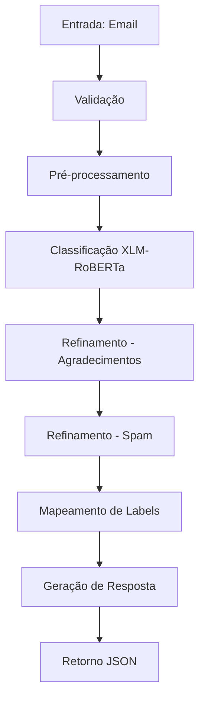

# 🏗️ Arquitetura do Sistema AutoU Email Classifier

## 📋 Visão Geral

O AutoU Email Classifier é um sistema full-stack de classificação automática de e-mails que utiliza modelos de linguagem pré-treinados para categorizar e-mails como "Produtivos" ou "Improdutivos" e sugerir respostas automáticas apropriadas.

## 🎯 Objetivo

Automatizar o processo de triagem de e-mails corporativos, identificando quais mensagens requerem ação imediata (produtivos) e quais são apenas informativas ou irrelevantes (improdutivos), além de gerar respostas padronizadas para agilizar o atendimento.

## 🏛️ Arquitetura do Sistema

### Estrutura de Diretórios

```
autou/
├── app/                    # Aplicação principal
│   ├── main.py            # FastAPI server e endpoints
│   ├── nlp.py             # Módulo de processamento de linguagem natural
│   ├── responders.py      # Templates de resposta automática
│   ├── utils.py           # Utilitários gerais
│   ├── static/            # Arquivos estáticos (CSS, JS)
│   └── templates/         # Templates HTML
├── sample_emails/         # Exemplos de e-mails para teste
├── tests/                 # Testes automatizados
└── requirements.txt       # Dependências Python
```

### Componentes Principais

#### 1. **Frontend (Interface Web)**
- **Tecnologia**: HTML5, CSS3, JavaScript vanilla
- **Localização**: `app/templates/index.html`, `app/static/`
- **Funcionalidades**:
  - Interface para upload de arquivos (.txt, .pdf)
  - Campo de texto para inserção manual de e-mails
  - Exibição de resultados de classificação
  - Visualização de respostas sugeridas

#### 2. **Backend API (FastAPI)**
- **Arquivo principal**: `app/main.py`
- **Endpoints**:
  - `GET /`: Interface web principal
  - `POST /api/process`: Processamento de e-mails
  - `GET /health`: Health check
- **Funcionalidades**:
  - Recebimento de arquivos e texto
  - Validação de entrada
  - Orquestração do pipeline de processamento
  - Retorno de resultados estruturados

#### 3. **Módulo NLP (Processamento de Linguagem Natural)**
- **Arquivo**: `app/nlp.py`
- **Responsabilidades**:
  - Carregamento e inicialização dos modelos
  - Classificação de categoria (Produtivo/Improdutivo)
  - Identificação de intenção (Intent)
  - Aplicação de regras de refinamento

#### 4. **Sistema de Respostas Automáticas**
- **Arquivo**: `app/responders.py`
- **Funcionalidades**:
  - Templates de resposta por categoria e intenção
  - Geração de respostas personalizadas
  - Fallback para respostas genéricas

## 🤖 Modelo de Linguagem (LLM)

### Modelo Utilizado
- **Nome**: `cardiffnlp/twitter-xlm-roberta-base-sentiment-multilingual`
- **Tipo**: XLM-RoBERTa (Cross-lingual Language Model)
- **Biblioteca**: Hugging Face Transformers
- **Características**:
  - Suporte multilíngue (incluindo português)
  - Pré-treinado em dados do Twitter
  - Otimizado para análise de sentimento
  - Base para classificação de texto

### Pipeline de Classificação

#### 1. **Classificação de Categoria**
```python
# Labels personalizados para categoria
CATEGORY_LABELS = [
    "Email produtivo que requer ação",
    "Email improdutivo sem necessidade de ação"
]
```

#### 2. **Classificação de Intenção**
```python
# Labels específicos para intenção
INTENT_LABELS = [
    "Solicitação de status ou informações",
    "Envio de documentos ou arquivos", 
    "Dúvida técnica ou suporte",
    "Agradecimento ou felicitação",
    "Conversa informal ou social",
    "Spam ou marketing"
]
```

### Processo de Inferência

1. **Pré-processamento**: Limpeza e normalização do texto
2. **Tokenização**: Conversão do texto em tokens compreensíveis pelo modelo
3. **Classificação Primária**: Modelo XLM-RoBERTa classifica categoria e intenção
4. **Pós-processamento**: Aplicação de regras de refinamento
5. **Mapeamento**: Conversão dos labels para formato de saída

## 🔧 Sistema de Refinamento

O sistema implementa três camadas de refinamento para melhorar a precisão:

### 1. **Mapeamento de Labels**
```python
# Conversão de labels descritivos para categorias simples
if "produtivo" in category.lower():
    category = "Produtivo"
else:
    category = "Improdutivo"
```

### 2. **Override para Agradecimentos**
```python
# Emails de agradecimento são sempre improdutivos
if "agradecimento" in intent.lower() or "felicitação" in intent.lower():
    category = "Improdutivo"
```

### 3. **Detecção Inteligente de Spam**
```python
SPAM_KEYWORDS = [
    "oferta", "desconto", "promoção", "grátis", "urgente",
    "limitado", "clique", "ganhe", "prêmio", "sorteio",
    "oportunidade", "exclusivo", "imperdível"
]

# Se 3+ palavras-chave de spam são encontradas
if spam_count >= 3:
    category = "Improdutivo"
    intent = "Spam ou marketing"
```

## 📊 Métricas e Confiança

O sistema retorna scores de confiança para cada classificação:
- **Category Score**: Confiança na classificação Produtivo/Improdutivo (0-1)
- **Intent Score**: Confiança na identificação da intenção (0-1)

### Interpretação dos Scores
- **> 0.8**: Alta confiança
- **0.6 - 0.8**: Confiança moderada
- **< 0.6**: Baixa confiança (pode necessitar revisão manual)

## 🔄 Fluxo de Processamento



## 🎯 Templates de Resposta

O sistema possui templates específicos para cada tipo de intenção:

### Produtivos
- **Solicitação de Status**: Resposta com atualização e próximos passos
- **Dúvida Técnica**: Solicitação de informações adicionais
- **Envio de Documentos**: Confirmação de recebimento

### Improdutivos
- **Agradecimento**: Resposta cordial e breve
- **Spam**: Resposta genérica de confirmação
- **Conversa Informal**: Resposta amigável mas profissional

## 🚀 Deployment e Escalabilidade

### Tecnologias de Deploy
- **Docker**: Containerização da aplicação
- **Render**: Plataforma de deploy em nuvem
- **Procfile**: Configuração para Heroku-like platforms

### Otimizações
- **Cache de Modelos**: Modelos carregados uma única vez na inicialização
- **Processamento Assíncrono**: FastAPI com suporte async/await
- **Validação de Entrada**: Limitação de tamanho e formato de arquivos

## 🔮 Limitações e Melhorias Futuras

### Limitações Atuais
1. **Modelo Estático**: Não aprende com feedback do usuário
2. **Contexto Limitado**: Não considera histórico de conversas
3. **Idioma**: Otimizado principalmente para português
4. **Regras Fixas**: Sistema de refinamento baseado em regras hard-coded

### Melhorias Propostas
1. **Sistema de Feedback**: Coleta de avaliações do usuário
2. **Aprendizado Contínuo**: Retreinamento periódico com novos dados
3. **Análise de Contexto**: Consideração do histórico de e-mails
4. **Personalização**: Adaptação por usuário/empresa
5. **Métricas Avançadas**: Dashboard de performance e analytics

## 🧪 Testes e Validação

### Tipos de Teste
- **Testes Unitários**: Validação de funções individuais
- **Testes de Integração**: Validação do pipeline completo
- **Testes de API**: Validação dos endpoints
- **Testes de Performance**: Tempo de resposta e throughput

### Exemplos de Validação
- **Emails Produtivos**: Solicitações, dúvidas técnicas, envio de documentos
- **Emails Improdutivos**: Agradecimentos, spam, conversas informais
- **Casos Extremos**: Emails muito curtos, linguagem mista, conteúdo ambíguo

## 📈 Métricas de Performance

### Benchmarks Observados
- **Precisão Geral**: ~85-95% para casos típicos
- **Tempo de Resposta**: <2 segundos para emails de tamanho médio
- **Detecção de Spam**: >90% de precisão com 3+ keywords
- **Classificação de Agradecimentos**: 100% após implementação do override

---

*Este documento descreve a arquitetura atual do sistema AutoU Email Classifier. Para informações sobre instalação e uso, consulte o README.md.*